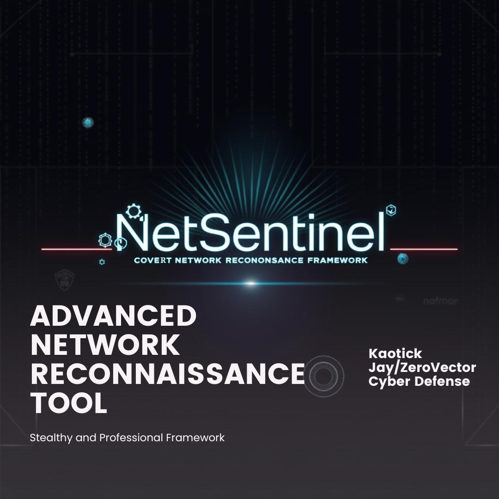

# NetSentinel
[](https://github.com/kaotickj/NetSentinel/releases)[](https://github.com/kaotickj/NetSentinel/LICENSE)[](https://www.python.org/)[](https://github.com/kaotickj/NetSentinel)[](https://github.com/kaotickj/NetSentinel/commits/master)




---

## 🛡️ Overview

**NetSentinel** is a Python-based red team reconnaissance framework designed for stealthy internal enumeration, service discovery, and lateral movement preparation.

> 🔥 **Intended for authorized red team operations only. Use without permission is illegal and unethical.**

---

## 🔧 Features

* 🔍 **Network Discovery** via ARP and DNS with stealth scan options  
* 🧠 **Hostname Resolution** via reverse DNS  
* 📦 **Custom Port Scanning** with default common TCP services  
* 📂 **Anonymous SMB Share Enumeration**  
* 🔐 **Kerberos Reconnaissance**:  
  * SPN Enumeration (Kerberoasting)  
  * AS-REP Roastable Account Detection  
  * Optional LDAP AD enumeration  
* 📄 **Export Results** to structured JSON and HTML  
* 🧩 **Modular Architecture** with extensibility in mind  
* 🧠 **Threaded Execution** for fast parallelized results  
* 🎨 **Stylized CLI Banner** using pyfiglet for professional look  

---

## 🛠️ Installation

### Clone the Repository

```
git clone https://github.com/kaotickj/NetSentinel.git
cd NetSentinel
````

### Install Dependencies

```
pip install -r requirements.txt
```

### Requirements

* Python 3.7+
* Dependencies include:

  * `scapy`
  * `colorama`
  * `impacket`
  * `ldap3`
  * `smbprotocol`
  * `pyfiglet`

---

## 🚀 Usage

### Basic Network Scan

```
python3 main.py --target 10.0.0.0/24
```

### Stealth Scan with Hostname Resolution

```
python3 main.py --target 10.0.0.0/24 --scan-type quick --resolve-hostnames
```

### SMB Share Enumeration

```
python3 main.py --target 10.0.0.0/24 --smb-enum
```

### Kerberos Recon with Config

```
python3 main.py --target 10.0.0.0/24 --kerberos-scan
```

> Kerberos credentials and DC IP are supplied via a config file (see Configuration section).

### Password Spraying

```
python3 main.py --target 10.0.0.0/24 --password-spray --user-list users.txt --password-list passwords.txt
```

### Export HTML Report

```
python3 main.py --target 10.0.0.0/24 --html-report report.html
```

---

## ⚙️ Configuration File

Kerberos and LDAP functionality require a config file with the following example fields:

```
{
  "domain": "corp.local",
  "username": "lowpriv",
  "password": "Spring2025!",
  "dc_ip": "10.0.0.5",
  "ldap_username": "ldapuser",
  "ldap_password": "ldappass"
}
```

INI format is also supported:

```
[NetSentinel]
domain = corp.local
username = lowpriv
password = Spring2025!
dc_ip = 10.0.0.5
ldap_username = ldapuser
ldap_password = ldappass
```

Place the config file in the project root or specify path in future releases.

---

## 🔎 CLI Options Summary

| Option                | Description                                           |
| --------------------- | ----------------------------------------------------- |
| `--target`            | Target IP or CIDR range (required)                    |
| `--scan-type`         | Scan mode: `quick` (default) or `full` (future)       |
| `--resolve-hostnames` | Perform reverse DNS lookups                           |
| `--ports`             | Comma-separated ports or `common` (default port list) |
| `--smb-enum`          | Enumerate SMB shares                                  |
| `--kerberos-scan`     | Perform Kerberos and LDAP enumeration                 |
| `--user-list`         | File with usernames for AS-REP and password spray     |
| `--password-list`     | File with passwords for spraying (optional)           |
| `--password-spray`    | Enable SMB password spraying                          |
| `--html-report`       | Output path for detailed HTML report                  |
| `--debug`             | Enable verbose debug logging                          |

---

## 🧪 Sample Workflows

### Full Passive Recon with Export

```
python3 main.py \
  --target 192.168.1.0/24 \
  --scan-type quick \
  --resolve-hostnames \
  --smb-enum \
  --kerberos-scan \
  --user-list ./users.txt \
  --html-report full_recon.html
```

### Lightweight Stealth Recon

```
python3 main.py --target 192.168.1.0/24 --scan-type quick
```

---

## 📂 Output

Scan results are structured per host and may include:

* IP address and MAC (if discovered)
* Hostname (if resolved)
* Open ports with banners
* SMB shares
* Kerberos SPNs and AS-REP roastable accounts
* Password spray success and failure logs
* Scan timing metrics per host
* Exported JSON and collapsible HTML reports

---

## 🤝 Contributing

We welcome contributions! Please see [CONTRIBUTING.md](CONTRIBUTING.md) for guidelines.

**Quick Start:**

1. Fork the repo.
2. Create a branch: `git checkout -b feature/your-feature-name`
3. Code, test, and commit your changes.
4. Open a pull request describing your work.

Please adhere to the existing coding style, include tests, and maintain security best practices.

---

## 🐞 Reporting Issues

Submit detailed issues on GitHub including:

* Platform and OS
* Command used
* Full error output or stack traces
* Expected vs actual behavior

---

## 📜 License

NetSentinel is licensed under the [GNU General Public License v3.0](LICENSE).

---

## 👤 Credits

Created and maintained by **Kaotick Jay**
30-year cybersecurity veteran | Red Team Lead | Linux & PHP Specialist

> Built for red teamers who value silence and precision.

---

